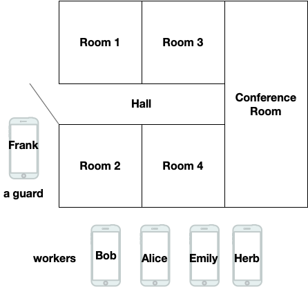

# Office Example

### (created for ACM ICN2021 Tutorial)

This example is for a small office. The office has:

- four people who use phone apps for access: Bob, Alice, Herb, and Emily. Alice is a manager.
- six rooms: four offices, a conference room, and a hall
- a room controller (raspPi-like) in each room that controls door lockset, light, temperature, screen and in hall controls light and door lockset

The rules for this office are:

- an employee controls all the functions in their assigned office
- a manager can also control the conference room and hall
- a guard (Frank is a guard) can control all door locks, lights, and temperature settings as a group (and not individually)
- a room controller publishes the status of its functions after it executes each command

Illustrated:

This example uses a generalized message-based pub/sub (mbps) shim that does not require a priori knowledge of the application or its trust schema, just requires that the final three components of the trust schema-defined publications are the tags required and set by mpbs  (mId/sCnt/mts). The rest can be whatever is convenient for the application.

Keep in mind that the trust schema is concerned with the communications of the applications that will form this trust zone and it is not necessary to cover every action that applications can perform. A trust schema writer should make sure that messages that could cause harm are not permitted. It's not necessary to prevent messages that an application would just discard (e.g., a phone app might tell a lock to "turn blue", but that would be meaningless to the lock which should discard it so it doesn't need to be restricted. If you have devices that enter an undefined state instead of throwing away undefined commands, then you ought to prevent them, of course). On the other hand, some commands are critical to prevent e.g., lights should not be issuing commands, and the trust schema can be used to ensure this, both preventing lightbulbs from creating such messages and preventing other devices from accepting them should a lightbulb somehow be compromised.

The slides from the tutorial are also in this directory.

## Testing trust schemas

There are two trust schemas in this directory. The office.trust version implements the rules above. The basicOffice.trust version shows that you can use a trust schema to make a trust zone that is merely covered by signing certificates and does not have the fine-grained role enforcement. You can experiment with adding more rules and commands to office.trust, then use schemaCompile to check your schema. 

 `schemaCompile -d office.trust`

You should read the README and the language documents in the DCT/versec directory and make use of the tools in DCT/tools. A possible exercise is to add a status message from employees indicating in-office or out-of-office or adding a guest role with permission to control the conference room screen.

## Testing the application

This is currently fiddly since you need to have the same library and forwarder environment that Pollere is using. Notes on this are in the DCT/README.md. We hope to improve this situation soon.

Should you be adventurous, you can use the mkIDs.sh script to generate identity bundles and then start room controllers with room identities. You can start all the rooms with the included *runRooms.sh* (you can *killall room* to stop) and then run phone applications from the command line by inputting the command along with an identity bundle for a user (e.g., alice.bundle, bob.bundle, emily.bundle, herb.bundle, frank.bundle). Examples:

/phone id/bob.bundle light on (room1 should turn on light) 
./phone id/bob.bundle confRm light on (should print error msg) 
./phone id/alice.bundle confRm light on (ok) 
./phone id/alice.bundle all light on (err) 
./phone id/frank.bundle light off (should turn all lights off 
./phone id/frank.bundle screen off (err)

